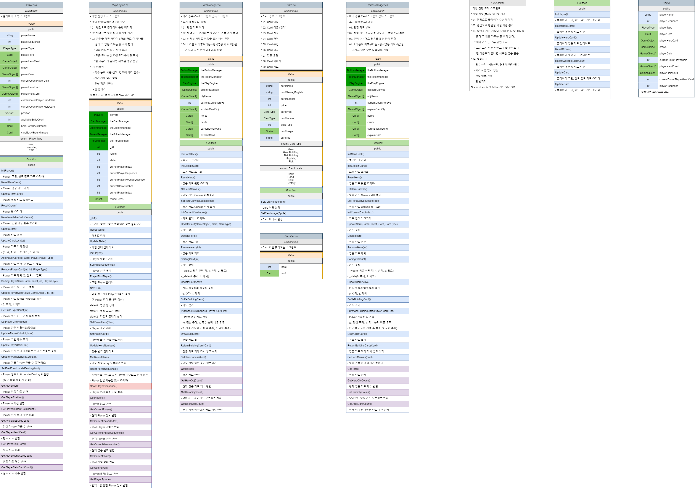

# Mulit-Card-Game-Project
### 보드 카드 게임 게임프로젝트입니다.

> 게임 이름 : '시타델' (시타델 보드 게임)

> 개발 환경

 * Game Project : Unity 2020.3.12f1 (64-bit) / Microsoft Visual Studio 2019  
 * Game UI : PhotoShop CC 2018
  
> 개발 언어 : C#
  
> 개발 기간 : 현재진행중
  
> 개발 동기  

보다 자세한 유니티 프로그래밍 공부와 멀티 네트워크 공부를 위해 시작된 프로젝트
기존에 존재하는 '시타델' 보드게임 로직 및 규칙을 그대로 사용하여 멀티 카드 게임을 만들어보는것이 목적이다.

> 게임 이미지

> 게임 스크립트 구성도

